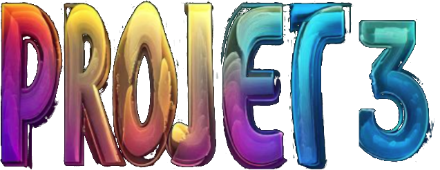
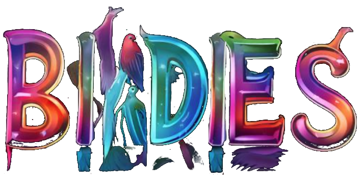

<center>  </center>

---

<center>  </center>

---

## <div style="background: linear-gradient(to right, red, orange, yellow, green, blue, indigo, violet); -webkit-background-clip: text; -webkit-text-fill-color: transparent; font-size: 1.6em"><u>Présentation général</u></div>

Birdies est un jeu de plateforme et d'exploration en 2D développé avec Pyxel, une bibliothèque de création de jeux rétro pour Python. Dans ce jeu, vous incarnez différents oiseaux aux capacités uniques, explorant un monde mystérieux rempli de défis, de secrets et d'énigmes à résoudre.

--------------

<br>

## <div style="background: linear-gradient(to right, red, orange, yellow, green, blue, indigo, violet); -webkit-background-clip: text; -webkit-text-fill-color: transparent; font-size: 1.6em"><u>Objectifs du jeu</u></div>

- Collecter des orbes colorées (bleues, rouges et vertes)

- Débloquer et maîtriser les trois types d'oiseaux

- Explorer le monde et découvrir ses secrets

- ~~Rendre hommage ?!?!~~

- Placer stratégiquement les stèles pour faciliter la navigation

- Atteindre la fin du jeu en remplissant toutes les conditions requises

---

<br>

## <div style="background: linear-gradient(to right, red, orange, yellow, green, blue, indigo, violet); -webkit-background-clip: text; -webkit-text-fill-color: transparent; font-size: 1.6em"><u>Comment jouer</u></div>

### Contrôles de base :

- Flèches directionnelles ou ZQSD : Déplacer l'oiseau

- ESPACE : Sauter

- ~~H : Rendre hommage (près de la tombe) ?!?!?!?!?!~~

- P : Placer une stèle

- C : Changer d'oiseau (une fois débloqués)

- T : Utiliser la capacité spéciale de téléportation

- R : Recommencer (en cas de mort) ou accéder au menu pause

---

### Les différents oiseaux :

<center> <u> <b> Oiseau Bleu </b> </u> </center>

<br>

- <u> Capacités </u>: Saut de base (x3), téléportation vers sa stèle
- <u> Particularité </u>: Disponible dès le début

<br>

<center> <u> <b> Oiseau Rouge </b> </u> </center>

<br>

- <u> Capacités </u> : Plus rapide et agile, téléportation vers sa stèle
- <u> Déblocage </u> : Collecter 6 orbes bleues

<br>

<center> <u> <b> Oiseau Vert </b> </u> </center>

<br>

- <u> Capacités </u> : Vol limité, téléportation vers sa stèle
- <u> Déblocage </u> : Collecter 8 orbes rouges

---

### Mécaniques de jeu :

<br>

- Collecte d'orbes : Ramassez les orbes colorées pour débloquer de nouvelles capacités et zones

- Système de stèles : Placez des stèles pour créer des points de téléportation (cooldown de 100 frames entre chaque placement)

- ~~Hommage : Rendez hommage pour débloquer le passage final ?!?!?!~~

- Exploration : Découvrez des zones cachées et des secrets

- Puzzle environnemental : Utilisez les capacités des différents oiseaux pour progresser

- Incarnez différents oiseaux : Choisissez entre l'oiseau bleu, rouge ou vert pour des capacités spéciales différentes !! (cooldown de 100 frames entre chaque changement d'oiseau)

---
<br>

## <div style="background: linear-gradient(to right, red, orange, yellow, green, blue, indigo, violet); -webkit-background-clip: text; -webkit-text-fill-color: transparent; font-size: 1.6em"><u>Structure du code</u></div>

Le jeu est organisé en plusieurs classes principales :

- <u> **App** </u>: Gère la logique principale du jeu, les différents modes (menu, jeu, sélection d'oiseau, etc.) et le rendu graphique.

- <u> **Bird1, Bird2, Bird3** </u>: Représentent les trois types d'oiseaux jouables, chacun avec ses propres caractéristiques et méthodes.

- <u> **Stele** </u>: Gère le placement et l'utilisation des points de téléportation.

- <u> **Tombe** </u>: S'occupe de la mécanique d'hommage et des dialogues associés.

- <u> **End** </u>: Vérifie les conditions de fin du jeu et affiche les messages appropriés.

- <u> **Save** </u>: Gère la sauvegarde et le chargement des parties.

- <u> **Particle** </u>: Implémente un système de particules pour les effets visuels.

---

<br>

## <div style="background: linear-gradient(to right, red, orange, yellow, green, blue, indigo, violet); -webkit-background-clip: text; -webkit-text-fill-color: transparent; font-size: 1.6em"><u>Fonctionnalités technique notables</u></div>

Système de collision basé sur les tuiles

Caméra suivant le joueur

Gestion d'états multiples (menu, jeu, sélection, etc.)

Sauvegarde et chargement de partie

Système de particules pour les effets visuels

Gestion des dialogues et messages à l'écran

---

<br>

## <div style="background: linear-gradient(to right, red, orange, yellow, green, blue, indigo, violet); -webkit-background-clip: text; -webkit-text-fill-color: transparent; font-size: 1.6em"><u>Installation et lancement</u></div>

- Assurez-vous d'avoir Python installé sur votre système.
- Installez Pyxel avec la commande : 
  ```bash
  pip install pyxel
  ```
- Téléchargez les [fichiers du jeu](https://github.com/Cassssian/Projet3/archive/refs/heads/main.zip).
- Lancez le jeu en exécutant le fichier principal : python nom_du_fichier_principal.py
  
OU

- Téléchargez la [release](https://github.com/Cassssian/Birdies/releases/tag/v1.0.0)
- Ouvrez le fichier .exe

*(il y aura aussi un fichier .zip avec toutes les ressources nécessaires et le code dans la release si vous voulez le modifier ou regarder le code 🙃)*

Et voilà !

---

<br>

## <div style="background: linear-gradient(to right, red, orange, yellow, green, blue, indigo, violet); -webkit-background-clip: text; -webkit-text-fill-color: transparent; font-size: 1.6em"><u>Conseil pour les développeurs</u></div>

Le code utilise des classes pour organiser la logique du jeu, facilitant l'extension et la maintenance.

Les collisions sont gérées par des méthodes spécifiques dans chaque classe d'oiseau.

La classe App contient la boucle de jeu principale et gère les transitions entre les différents états du jeu.

Le système de sauvegarde utilise JSON pour stocker les données de jeu.

Les assets graphiques et audio sont stockés dans un fichier Pyxres (.pyxres).

---

<br>

## <div style="background: linear-gradient(to right, red, orange, yellow, green, blue, indigo, violet); -webkit-background-clip: text; -webkit-text-fill-color: transparent; font-size: 1.6em"><u>Conclusion</u></div>

Birdies offre une expérience de jeu unique mêlant plateforme, exploration et puzzle. Le code est structuré de manière à faciliter l'ajout de nouvelles fonctionnalités ou la modification des mécaniques existantes. N'hésitez pas à explorer le code source pour comprendre en détail le fonctionnement du jeu et potentiellement y apporter vos propres améliorations !

---
<br>
<br>


## <div style="background: linear-gradient(to right, red, orange, yellow, green, blue, indigo, violet); -webkit-background-clip: text; -webkit-text-fill-color: transparent; font-size: 1.6em"><u>Contribution</u></div>

Les contributions sont les bienvenues ! N'hésitez pas à ouvrir une issue ou à soumettre une pull request.

---

<br>

## <div style="background: linear-gradient(to right, red, orange, yellow, green, blue, indigo, violet); -webkit-background-clip: text; -webkit-text-fill-color: transparent; font-size: 1.6em"><u>Auteur</u></div>

- [DucceschKleinsansklien Industries®](https://github.com/Cassssian)
